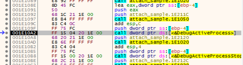
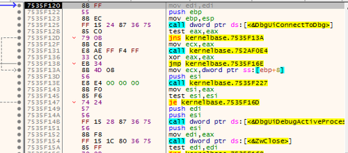
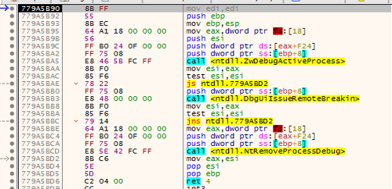
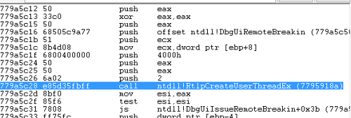
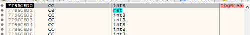
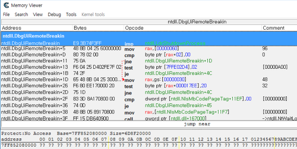

# Windows Anti Attach Debugger [KR]

## Anti Reverse Engineering

흔히들 말하는 리버싱 (Reverse Engineering) 은 소프트웨어 역공학을 일컫는 말이다. 개발자는 원시 코드를 작성하고, 컴파일러를 통해 목적 파일을 만들어 낸다. 이 과정에서 원시 프로그램을 이루던 고급 언어들은 컴퓨터가 이해하기 쉬운 언어로 변환된다. 그 대표적인 예시로 기계어와 어셈블리어를 들 수 있을 것이다. 변환 과정에서 사람들의 이해를 돕던 변수명, 함수명 등은 "Debugging Symbol" 이라는 이름으로 목적 프로그램에 기재되기도 한다. 반면, 사람들이 인식하기 쉬운 프로그램의 구조, 구문, 추상화된 틀은 컴퓨터가 이해하기 쉽게 그 과정들이 풀어 헤쳐지기도 하고, 최적화를 목적으로 생략되기도 한다. 결과적으로 목적 프로그램과 원시 프로그램은 같은 역할을 하지만, 그 구조는 사람 보다는 컴퓨터의 실행에 초점이 맞춰져 있다.

소프트웨어 역공학은 이렇게 생성된 목적 프로그램 (이하, 바이너리) 의 행위를 분석하고, 만들어진 이유를 찾아가는 행위를 의미한다. 이 과정에서 바이너리가 가지고 있는 결함을 발견할 수도 있고, 개발자가 숨겨둔 기능을 찾기도 한다. 개발자 입장에서 이러한 부수 효과는 반가운 손님이 아니다. 소프트웨어의 결함이 발견되었다고 가정할 때, 이를 이용하는 악의적인 사용자에 의해 1차, 2차 피해가 발생할 수 있다. 또한, 숨겨둔 기능을 활용하여 정상적인 사용자라면 불가능한 행위를 통해 서비스에 문제를 일으킬 수도 있다.

여러모로 개발자의 입장에서 역공학 과정은 껄끄러울 수밖에 없다. 소프트웨어의 결함이나 숨겨진 기능의 발견은 서비스에 부수 효과를 일으키며, 부수 효과가 이득이 될지 손해가 될지도 발견되기 이전에는 알 수 없는 부분이다. 이러한 이유에서 역공학을 방지하고자 하는 움직임이 발생하기 시작했다. 이를 Anti Reverse Engineering 이라고 하며, 따로 번역할 말이 없으니 안티 리버싱 정도로 부르자.

역공학 과정에서 요구되는 가장 중요한 도구는 디버거가 아닐까 한다. 컴퓨터의 입장에서 프로그램이 실행되는 순서를 눈으로 확인하는 과정을 디버깅이라 하고, 이를 도와주는 도구가 디버거이기에, 디버거와 소프트웨어 사이의 상호 작용을 막아서는 것이 어찌 보면 효율적인 안티 리버싱 기술의 초안이 될 수 있다. 디버거의 어태치 과정을 차단하거나, 디버깅 이벤트를 차단하거나, 메모리의 읽기 쓰기를 막는 등 많은 안티 리버싱 기술들이 디버거의 작용에 초점이 맞추어져 있다.

이번 글에서는 안티 디버깅 기술 중 하나인 Anti Attach 에 대해 다룬다.

## Windows API 를 활용한 Debugging 과정

앞서 이야기하였듯이, 많은 안티 리버싱 기법들은 디버거의 작용에 초점이 맞추어져 있다. 그렇다면, 디버거(Debugger) 와 대상 프로그램 (이하, 디버기 Debuggee) 과의 소통 과정이 있을 것이고, 안티 리버싱 기법들은 이 과정을 방해하거나, 혹은 불가능하게 하는 역할들을 주로 하게 될 것이다. 먼저 디버거와 프로그램이 상호 작용하는 과정을 알아야 한다.

Windows 에서는 크게 두 가지 방법으로 프로그램을 디버깅할 수 있다. 하나는 디버거에서 프로그램을 실행시키는 것이고, 다른 하나는 실행돼 있는 프로그램에 디버거를 붙이는 것이다. 차이점은 디버거와 프로세스가 상호작용을 처음 시작하는 시점에서 프로그램이 실행돼 있는지 정도일 것이다. 전자의 경우에는 프로그램이 실행되어 있지 않은 상태에서 디버거가 디버기 프로세스로써 프로그램을 실행시키는 것이고, 후자의 경우에는 실행돼 있는 프로세스에 디버거를 붙여, 대상 프로세스를 디버기로 만드는 것이다. 당연히 후자의 경우에 대상 프로세스에 권한이 없다면, 정상적인 디버깅이 불가능할 것이다.

첫 번째로 살펴볼 것은 디버거에서 프로세스를 실행시키는 것이다. 아래의 예제를 보며 설명한다. 

```c++
int DebugProcess(WCHAR* filename) {
    STARTUPINFO si;
    PROCESS_INFORMATION pi;
 
    memset(&si, 0, sizeof(si));
    memset(&pi, 0, sizeof(pi));
 
    CreateProcessW(filename, NULL, NULL, NULL, FALSE, CREATE_NEW_CONSOLE | DEBUG_PROCESS, NULL, NULL, &si, &pi);
 
    DEBUG_EVENT dbgEvent;
    bool dbgContinue = true;
 
    while (dbgContinue) {
        if (FALSE == WaitForDebugEvent(&dbgEvent, 100)) {
            continue;
        }
    
        switch (dbgEvent.dwDebugEventCode) {
        case CREATE_PROCESS_DEBUG_EVENT:
            // handling when process created
        case EXIT_PROCESS_DEBUG_EVENT:
            // handling when process exited
        case LOAD_DLL_DEBUG_EVENT:
            // handling when dll loaded
        case UNLOAD_DLL_DEBUG_EVENT:
            // handling when dll unloaded
        case EXCEPTION_DEBUG_EVENT:
            // handling when exception occured
        default:
            break;
        }
    
        DWORD status = DBG_CONTINUE;
        ContinueDebugEvent(dbgEvent.dwProcessId, dbgEvent.dwThreadId, status);
    }
 
    return 0;
}
```

Windows API 에는 새로운 프로세스를 실행시킬 수 있는 함수인 CreateProcess 가 존재한다. 첫 번째 인자인 lpApplicationName 은 실행시킬 프로세스의 이름을 의미하고, 여섯 번째 인자인 dwCreationFlags 는 프로세스의 실행 속성을 의미한다. 여기서 눈여겨 봐야 할 것은 여섯 번째 인자인 dwCreationFlags 이다. CreateProcess 는 프로세스를 여러 가지 속성에 따라 실행시킬 수 있는데, 그중에는 디버기로써 프로세스를 실행시킬 수 있는 DEBUG_PROCESS 속성이 존재한다.

DEBUG_PROCESS 에 의해 생성된 프로세스는 자신을 실행시킨 프로세스인 디버거와 디버그 이벤트를 주고받으며, 이 과정을 디버깅이라 일컫는 것이다. windbg, ollydbg, x64dbg 등의 상용 디버거들은 디버깅 이벤트를 주고받는 과정을 몇 가지 패턴으로 정리하고, 사용자에게 여러 가지 유틸리티와 함께 하나의 인터페이스로써 디버깅 환경을 제공한다.

디버거는 WinAPI 인 WaitForDebugEvent 함수를 통해 디버기에서 디버깅 이벤트를 받아올 수 있다. 전달받은 디버깅 이벤트는 DEBUG_EVENT 구조체에 저장되며, 두 번째 인자로 전달받은 밀리세컨드 마다 상태를 초기화할 수 있다. DEBUG_EVENT 구조체는 디버깅 이벤트가 발생한 프로세스의 PID 와 스레드의 TID, 디버깅 이벤트를 식별할 수 있는 dwDebugEventCode 를 가지며, union 으로 해당 디버깅 이벤트 정보가 담긴 구조체들을 내포한다. 당장 디버기에 디버깅 이벤트가 발생하면 디버기 프로세스는 잠시 정지 상태에 놓이고, 디버거의 ContinueDebugEvent 를 통해 디버기를 계속해서 실행 (Resume, Continuation) 시켜주지 않으면, 디버기는 디버거의 명령을 기다리며 다음 코드를 실행시키지 못한다. ContinueDebugEvent 의 인자로 DBG_CONTINUE 가 넘어오면, 디버기는 정상적으로 이벤트가 핸들링 되었다고 판단하고 프로세스를 정상실행 시키고, DBG_EXCEPTION_NOT_HANDLED 가 넘어오면 디버거가 이벤트를 핸들링 못 했다고 판단하고 해당 예외를 처리할 수 있는 다른 핸들러를 찾거나, 프로세스를 종료하게 된다.

디버깅 이벤트로는 CREATE_PROCESS_DEBUG_EVENT, EXIT_PROCESS_DEBUG_EVENT, CREATE_THREAD_DEBUG_EVENT, EXIT_THREAD_DEBUG_EVENT, EXCEPTION_DEBUG_EVENT, LOAD_DLL_DEBUG_EVENT, UNLOAD_DLL_DEBUG_EVENT, OUTPUT_DEBUG_STRING_EVENT, RIP_EVENT 로 9개가 존재하며, 각각 프로세스가 생성되었을 때, 프로세스가 종료되었을 때, 스레드가 생성되었을 때, 스레드가 종료되었을 때, 프로세스에 예외가 발생했을 때, DLL 이 로드되었을 때, DLL 이 언로드되었을 때, 디버그 스트링이 생성되었을 때, 시스템 디버깅 과정에서 문제가 생겼을 때 발생한다. EXCEPTION_DEBUG_EVENT 와 RIP_EVENT 를 제외한 이벤트는 추가적인 핸들링 없이 Continuation (ContinueDebugEvent, DBG_CONTINUE) 만으로 디버기의 정상 실행이 가능하다. 반면, EXCEPTION_DEBUG_EVENT 와 RIP_EVENT 는 일부 핸들링을 필요로 하며, 일부는 프로세스의 실행에 직접적인 영향을 끼친다. 디버깅 이벤트 핸들링에 대한 자세한 내용은 다음으로 미룬다. 

두번째로 프로세스에 디버거를 붙이는 Attach 과정이다. 

```c++
int AttachDebugger(int pid) {
    
    DebugActiveProcess(pid);
 
    DEBUG_EVENT dbgEvent;
    BOOL dbgContinue = TRUE;
 
    while (dbgContinue) {
        if (FALSE == WaitForDebugEvent(&dbgEvent, 100)) {
            continue;
        }
 
        switch (dbgEvent.dwDebugEventCode) {
        // handling event
        }
 
        ContinueDebugEvent(dbgEvent.dwProcessId, dbgEvent.dwThreadId, DBG_CONTINUE);
    }
 
    return 0;
}
```

CreateProcess 함수가 DebugActiveProcess 로 바뀐 것 외에는 같은 코드이다. 이미 실행 중인 프로세스에는 DebugActiveProcess 를 통해 해당 프로세스의 디버깅 이벤트를 받아올 수 있다. 이 때 대상 프로세스를 PROCESS_ALL_ACCESS 로 열 수 있는 권한이 없거나, 다른 프로세스가 이미 디버깅 중일 때는 대상 프로세스에 디버거를 어태치할 수 없다. 

글의 본문에서 이야기할 Anti Attach 는 프로세스에 디버거를 붙일 수 없도록 하는 기술을 의미한다. 프로세스에 디버거를 붙이지 못하면, 실행된 프로세스에 대한 정상적인 디버깅이 불가능하고, 프로그램을 디버거 수준에서 실행하지 않는 한, 일반적인 방법으로 프로그램을 분석하기 힘들어진다. DebugActiveProcess 를 리버싱하여 자식 프로세스에서 디버거가 Attach 되었음을 판별할 수 있는 방법에 대하여 연구한다. 

## DebugActiveProcess 분석

임의로 DebugActiveProcess 함수를 호출하는 프로그램을 작성하여 디버깅해본다.



kernelbase.DebugActiveProcess 함수는 내부적으로 ntdll.DbgUiConnectToDbg 함수와 kernelbase.ProcessIdToHandle함수, ntdll.DbgUiDebugActiveProcess 함수를 호출한다.



이중에서 주목해야할 함수는 DbgUiDebugActiveProcess 이다. 이 함수는 내부적으로 ntdll.DbgUiIssueRemoteBreakin 함수를 호출한다.



DbgUiIssueRemoteBreakin 함수는 ntdll.RtlpCreateUserThreadEx 함수를 통해 디버기 프로세스에 스레드를 생성하는데, 이 때 스레드의 목적 함수가 ntdll.DbgUiRemoteBreakin 이다.



실제로 디버거가 처음으로 프로세스에 어태치하면, DbgUiRemoteBreakin 함수에서 bp 가 걸리는 것을 확인할 수 있다.


이 함수는 ntdll.DbgBreakPoint 함수를 통해 디버기 프로세스에서 int 3 : Software Break Point 예외를 발생시킨다.



이 과정들을 도식화하면 다음과 같다.


kernelbase.DebugActiveProcess 부터 ntdll.RtlpCreateUserThreadEx 가 디버거에서 프로세스에 어태치할 때 사용하는 함수들이라면, 디버기에서는 ntdll.DbgUiRemoteBreakin 함수가 새로 만들어진 스레드에 의해서 실행된다. 반대로, ntdll.DbgUiRemoteBreakin 함수가 현재 프로세스에서 실행된다면, 어떤 다른 프로세스에서 프로세스 자신에 디버거로써 어태치를 시도했다고 볼 수 있다. 이를 토대로 Anti Attach 기술을 구현할 수 있게 된다. 



실제로 한 보안 모듈로 보호된 프로세스를 살펴본 결과, DbgUiRemoteBreakin 함수가 후킹되어 있었고 ntdll.LdrShutdownProcess 로 리다이렉팅하는 것을 확인할 수 있었다. 디버거에서 어태치를 시도하면, 프로세스를 종료해버리는 것이다. 

## Anti Attach 구현

DebugActiveProcess 함수를 분석하여, 다른 프로세스에서 현재 프로세스에 디버거로써 어태치하려고 시도하면, 현재 프로세스에 새로운 스레드가 생성되고, DbgUiRemoteBreakin 함수가 실행되는 것을 확인할 수 있었다. 이 함수가 호출되는 시점에서 디버거의 어태치를 탐지할 수 있게 된다. 

DbgUiRemoteBreakin 함수를 후킹하여, 위의 보안 모듈처럼 어태치 시도가 있을 때, 프로그램을 종료시키도록 구현하였다.

```c++
#include <stdio.h>
#include <Windows.h>
 
__declspec(naked) void AntiAttach() {
    __asm {
        jmp ExitProcess
    }
}
 
int main() {
    HANDLE hProcess = GetCurrentProcess();
 
    HMODULE hMod = GetModuleHandleW(L"ntdll.dll");
    FARPROC func_DbgUiRemoteBreakin = GetProcAddress(hMod, "DbgUiRemoteBreakin");
 
    WriteProcessMemory(hProcess, func_DbgUiRemoteBreakin, AntiAttach, 6, NULL);
 
    int a, b;
    scanf("%d %d", &a, &b);
 
    printf("result : %d\n", a + b);
 
    system("pause");
    return 0;
}
```

AntiAttach 함수를 보면, __declspec(naked) 로 정의된 것을 볼 수 있다. 이는 x86 환경에서 스택을 보존, 생성, 파기, 복구시키는 함수의 프롤로그와 에필로그 과정을 만들지 말라는 의미이며, 이러한 함수를 naked 함수라고 부른다. 이렇게 정의된 함수는 컴파일러 수준에서 프롤로그와 에필로그를 생성하지 않는다. 또한, __asm 구문으로 어셈블리를 그대로 생성하였다. 이로써 AntiAttach 함수는 ExitProcess 로 점프하는 6바이트짜리 함수가 된다. 6바이트인 이유를 덧붙이자면, x86 아키텍처에서 ExitProcess 와 같은 절대 주소 점프문은 FF 25 [ADDR 4byte] 로 총 6바이트이다.

main 에서는 GetModuleHandle 을 통해 ntdll 의 핸들을 얻어오고, GetProcAddress 를 통해 DbgUiRemoteBreakin 함수의 주소를 얻어온다. 이후, DbgUiRemoteBreakin 함수를 AntiAttach 함수로 덮어쓰는데, 이를 통해 DbgUiRemoteBreakin 함수가 실행되면 jmp ExitProcess 명령어가 실행되는 효과를 얻을 수 있다. 이렇게, 함수의 코드를 덮어써 원하는 방향으로 실행 흐름을 바꾸는 기법을 후킹이라고 하며, jmp 나 call 같은 명령어를 이용하는 기법을 특히 인라인 후킹이라고 한다. 

이를 통해 디버거가 프로세스에 어태치하려 하면, 프로세스가 종료되는 것을 확인할 수 있다. 반대로, 이를 우회하려면 프로세스에 디버거를 어태치하기 전에, 후킹된 함수를 복구시키면 된다. 자세한 내용은 다음 주소를 참고한다. https://github.com/revsic/AntiDebugging/blob/master/AntiAntiAttach.cpp

이상 Anti Attach 에 대한 리포트를 마친다.
